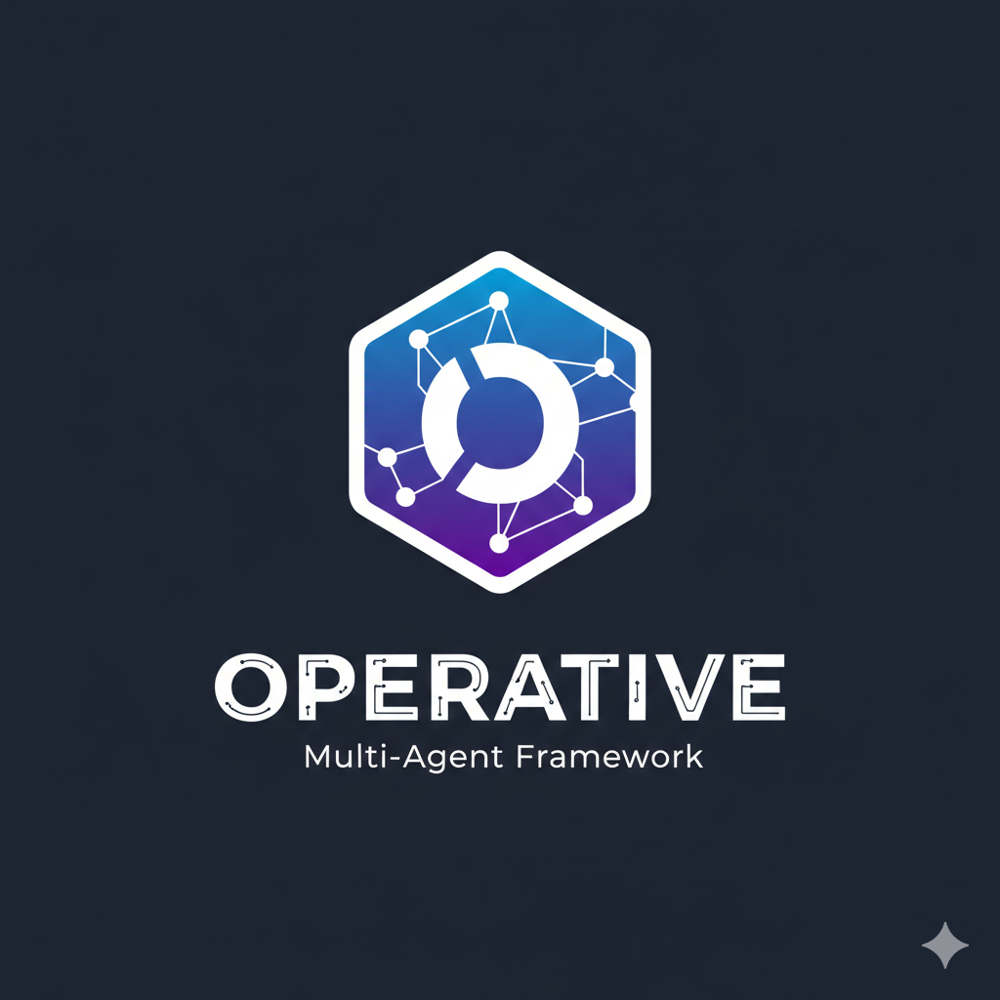

<div align="center">
  
  <h1>Operative</h1>
</div>

Operative is a Chrome Extension that orchestrates AI agents to perform tasks using the Model Context Protocol (MCP). It leverages Chrome's built-in AI capabilities (`window.ai`) to route user requests to specialized agents and execute tools.

## Features

- **Meta Orchestrator**: Advanced hierarchical routing that handles multi-level agent trees (Orchestrators vs. Workers).
- **Intelligent Task Decomposition**: Automatically breaks down complex user requests into sequential subtasks assigned to specialized agents.
- **Model Context Protocol (MCP)**: Seamlessly connects to external MCP servers to extend agent capabilities with real-world tools.
- **Chrome Built-in AI**: Leverages the local `window.ai.languageModel` (Gemini Nano) for private, fast, and local inference.
- **Customizable Multi-Agent Workflows**: Create specialized agents with unique system prompts and tool assignments to build a collaborative AI team.
- **Modern Chat Interface**: Interactive chat with progress tracking for complex multi-step tasks.

## Quick Start

### Prerequisites

- **Node.js**: Version 18 or higher.
- **Chrome Canary**: For the latest `window.ai` features (or a browser supporting the Prompt API).
- **Enable Gemeni Nano**: Follow the guide [here](https://developer.chrome.com/docs/ai/built-in) to enable the built-in AI in Chrome.

### Installation

1.  **Clone the repository**:
    ```bash
    git clone https://github.com/yourusername/operative.git
    cd operative
    ```

2.  **Install dependencies**:
    ```bash
    npm install
    ```

3.  **Build the extension**:
    ```bash
    npm run build
    ```

4.  **Load into Chrome**:
    - Open `chrome://extensions/`
    - Enable "Developer mode" (top right).
    - Click "Load unpacked".
    - Select the `dist` directory created by the build.

### Running the Demo MCP Server

To see the tool capabilities in action, you can run the included demo server:

```bash
npm run mcp:demo-server
```

This starts a local MCP server at `http://127.0.0.1:3333` providing `echo` and `get_time` tools.
It also provides a `prettier_format` tool for formatting code snippets via Prettier.

### Configuration

1.  Open the extension popup.
2.  Go to **Settings**.
3.  Add the MCP server URL: `http://127.0.0.1:3333/sse` (if using the demo server).
4.  Go to **Agents**.
5.  Create a new agent (e.g., "Timekeeper") and assign it the `get_time` tool.

## Documentation

- [Architecture Overview](docs/architecture.md)
- [Developer Guide](docs/developer_guide.md)
