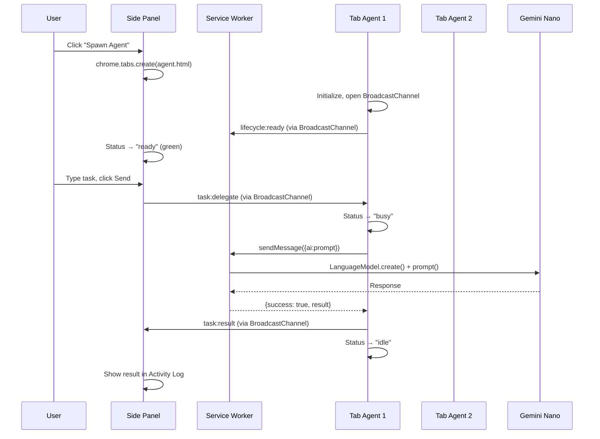
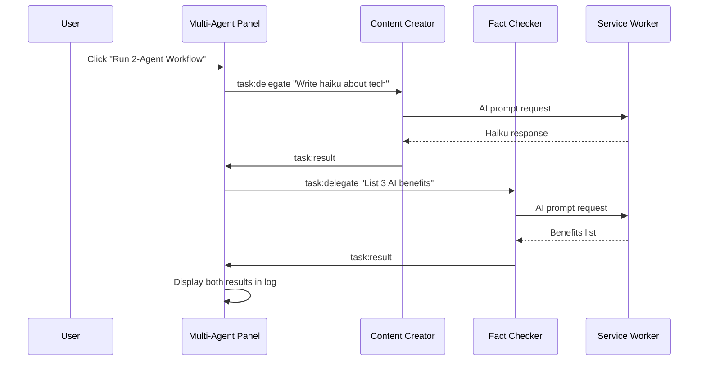

# Operative: Multi-Agent Browser Runtime

A fully local, browser-native multi-agent AI system powered by Chrome's built-in Gemini Nano. Each browser context (tab, window, worker) can host an independent AI agent communicating via native browser primitives.

**No API keys. No cloud. Everything runs locally in your browser.**

---

## Quick Start

### 1. Build & Install

```bash
npm install
npm run build
```

1. Open `chrome://extensions/`
2. Enable **Developer mode**
3. Click **Load unpacked** → select the `dist` folder

### 2. Enable Chrome AI

1. `chrome://flags/#optimization-guide-on-device-model` → **Enabled BypassPerfRequirement**
2. `chrome://flags/#prompt-api-for-gemini-nano` → **Enabled**
3. Restart Chrome
4. `chrome://components/` → Update "Optimization Guide On Device Model"

### 3. Create Agents

1. Click the Operative extension icon → Side panel opens
2. Go to **Agents** tab (🤖)
3. Create agents like:

**Content Creator**
```
Type: Worker
System Prompt: You are a creative content writer. Write engaging,
concise content for social media, blogs, and marketing materials.
```

**Fact Checker**
```
Type: Worker
System Prompt: You are a fact-checker and analyst. Provide accurate,
well-reasoned analysis with bullet points and clear explanations.
```

### 4. Test Multi-Agent

1. Go to **Multi-Agent** tab (👥)
2. Select an agent → Click **Spawn** (opens in new tab)
3. Wait for status to turn **green (ready)**
4. Type a task → Click ▶️ to send
5. Watch the Activity Log for responses!

---

## Architecture

```
┌─────────────────────────────────────────────────────────────────┐
│                     Chrome Extension (MV3)                       │
├─────────────────────────────────────────────────────────────────┤
│                                                                  │
│  ┌──────────────────┐                    ┌───────────────────┐  │
│  │   Service Worker │◄── LanguageModel ──│   Gemini Nano     │  │
│  │   (Coordinator)  │        API         │   (Local AI)      │  │
│  └────────┬─────────┘                    └───────────────────┘  │
│           │                                                      │
│           │ chrome.runtime.sendMessage (AI proxy)               │
│           │                                                      │
│           ▼                                                      │
│  ┌─────────────────┐    BroadcastChannel    ┌────────────────┐  │
│  │    Side Panel   │◄──────────────────────►│   Tab Agents   │  │
│  │  (Orchestrator) │                        │   (Workers)    │  │
│  └─────────────────┘                        └────────────────┘  │
│                                                                  │
│  ┌───────────────────────────────────────────────────────────┐  │
│  │                      IndexedDB                             │  │
│  │  ┌─────────┐ ┌──────────┐ ┌───────────┐ ┌──────────────┐  │  │
│  │  │ Agents  │ │ Messages │ │ TaskQueue │ │ GlobalMemory │  │  │
│  │  └─────────┘ └──────────┘ └───────────┘ └──────────────┘  │  │
│  └───────────────────────────────────────────────────────────┘  │
└─────────────────────────────────────────────────────────────────┘
```

### Key Insight: AI Lives in Service Worker

The `LanguageModel` API is **only available in the MV3 service worker**. All other contexts (side panel, tabs) call AI through `chrome.runtime.sendMessage`:

```
Tab Agent                    Service Worker                 Gemini Nano
    │                              │                              │
    │ sendMessage({ai:prompt})     │                              │
    │─────────────────────────────►│                              │
    │                              │  LanguageModel.create()      │
    │                              │─────────────────────────────►│
    │                              │  session.prompt()            │
    │                              │─────────────────────────────►│
    │                              │◄─────────────────────────────│
    │◄─────────────────────────────│  response                    │
    │                              │                              │
```

---

## Sequence Diagrams

### Multi-Agent Task Flow



### 2-Agent Workflow Demo



---

## Project Structure

```
src/
├── runtime/                    # Multi-agent runtime core
│   ├── protocol/
│   │   └── types.ts           # Message types, AgentIdentity
│   ├── channels/
│   │   ├── BroadcastManager.ts # Pub/sub communication
│   │   └── DirectChannel.ts    # Point-to-point messaging
│   ├── memory/
│   │   ├── GlobalMemory.ts     # Shared IndexedDB storage
│   │   └── LocalMemory.ts      # Per-agent ephemeral memory
│   ├── registry/
│   │   └── AgentRegistry.ts    # Track active agents
│   ├── lifecycle/
│   │   ├── AgentSpawner.ts     # Spawn agents in tabs
│   │   └── AgentContext.ts     # Agent runtime bootstrap
│   ├── orchestration/
│   │   ├── TaskQueue.ts        # Distributed task queue
│   │   └── WorkflowEngine.ts   # Multi-step workflows
│   └── spec/
│       ├── AgentSpec.ts        # Agent DSL types
│       └── SpecParser.ts       # Spec validation
│
├── background/
│   └── index.ts               # Service Worker (Coordinator + AI)
│
├── services/
│   ├── ai/
│   │   └── ChromeAIService.ts # LanguageModel API wrapper
│   └── orchestrator/
│       └── Orchestrator.ts    # Message routing
│
├── components/                # React UI
│   ├── Chat.tsx              # Chat interface
│   ├── AgentList.tsx         # Agent management
│   ├── AgentEditor.tsx       # Create/edit agents
│   ├── MultiAgentPanel.tsx   # Spawn & control agents
│   └── Settings.tsx          # MCP server config
│
└── store/
    └── db.ts                  # Dexie database schema

public/
├── agent.html                # Tab agent UI
└── agent.js                  # Tab agent logic (CSP-compliant)
```

---

## Communication Protocol

### Message Structure

```typescript
interface AgentMessage {
  id: string;              // Unique message ID
  correlationId?: string;  // Request/response tracking
  type: MessageType;       // task:delegate, lifecycle:ready, etc.
  source: AgentIdentity;   // Sender info
  target: MessageTarget;   // Recipient specification
  payload: any;            // Message data
  timestamp: number;
}
```

### Message Types

| Type | Direction | Description |
|------|-----------|-------------|
| `lifecycle:ready` | Agent → Coordinator | Agent initialized |
| `lifecycle:terminate` | Coordinator → Agent | Shutdown request |
| `task:delegate` | Panel → Agent | Assign task |
| `task:accept` | Agent → Panel | Task accepted |
| `task:result` | Agent → Panel | Task completed |
| `task:error` | Agent → Panel | Task failed |
| `heartbeat:ping` | Coordinator → All | Liveness check |
| `heartbeat:pong` | Agent → Coordinator | Status response |

### Channels

| Channel | Purpose |
|---------|---------|
| `operative:system` | Lifecycle, registry, heartbeat |
| `operative:tasks` | Task delegation and results |
| `operative:memory` | Memory change notifications |

---

## Example Prompts

### Content Creator
- "Write an Instagram caption about morning routines (include emojis)"
- "Create a professional LinkedIn post about AI trends"
- "Write a catchy headline for a blog about remote work"

### Fact Checker
- "List 5 key facts about renewable energy"
- "Explain the difference between HTTP and HTTPS"
- "What are the main symptoms of dehydration?"

### Research Agent
- "Summarize the key points of agile methodology"
- "What are the pros and cons of microservices?"
- "Explain blockchain in simple terms"

---

## Tech Stack

| Component | Technology |
|-----------|------------|
| Runtime | Chrome Extension MV3 |
| AI | Chrome LanguageModel API (Gemini Nano) |
| UI | React 19 + TailwindCSS |
| Storage | Dexie.js (IndexedDB) |
| Communication | BroadcastChannel API |
| Build | Vite + TypeScript |

---

## Development

```bash
# Install dependencies
npm install

# Development (hot reload)
npm run dev

# Production build
npm run build

# Type check
npx tsc --noEmit
```

---

## Troubleshooting

### "AI not available"
1. Check `chrome://flags` settings are enabled
2. Go to `chrome://components/` and update the model
3. Restart Chrome completely

### Agents stuck at "spawning"
1. Check the agent tab's DevTools console for errors
2. Make sure IndexedDB has the agent definition
3. Reload the extension

### CSP errors
- Agent pages must use external scripts, not inline
- Check that `agent.js` is in the `dist` folder

---

## Roadmap

- [ ] Visual workflow builder
- [ ] Agent-to-agent direct communication
- [ ] Streaming responses in UI
- [ ] Agent templates marketplace
- [ ] Performance monitoring dashboard
- [ ] MCP tool integration for agents

---

## License

MIT

---

Built with Chrome's Built-in AI (Gemini Nano) 🤖
